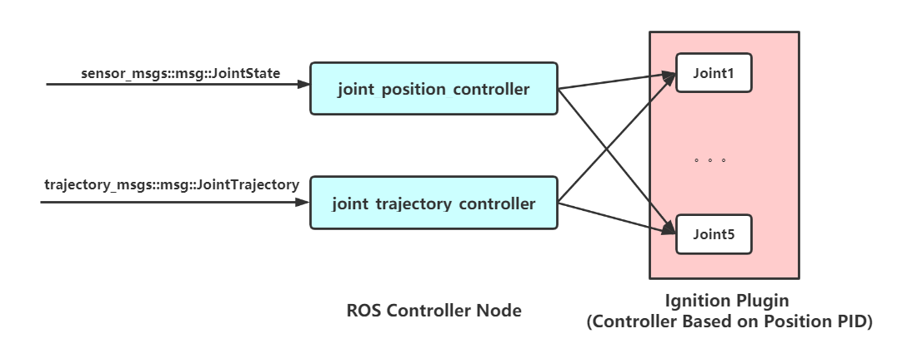

# universal_robot_ign

 `universal_robot_ign`  : Run universal robot  in Ignition Gazebo simulator . 

It provides SDF models of universal robot for Ignition Gazebo. In addition, it also provides a moveit2 application demo and simple  grasp demo with Gripper Robotiq140 . 

## 1. Usage

#### Install

* ROS: foxy
* Ignition :Dome 

```bash
#install dependency
sudo apt-get install ros-foxy-joint-state-publisher-gui
#cd src of ros2 workspace and download source code
git clone https://github.com/gezp/universal_robot_ign.git
#cd ros2 workspace and build
colcon build
```

####  UR10 moveit2 demo

* use  `moveit2` and `joint_trajectory_controller` to control UR10.

> moveit2 should be installed: [MoveIt 2 Source Build - Linux](https://moveit.ros.org/install-moveit2/source/)

launch Ignition Gazebo simulator for UR10 

```bash
ros2 launch universal_robot_ign ur10_ign.launch.py 
```

*  `ur10_ign` uses  `joint_trajectory_controller`

launch moveit2 `move_group` action server for UR10.

```bash
ros2 launch universal_robot_ign ur10_moveit2_demo.launch.py 
```

run moveit2  client node, plan to goal

```bash
ros2 run universal_robot_ign test_pose_goal.py
```

* start position <-> goal pose:  `[-0.0, 0.4, 0.6, 0.0, 0.0, 0.0]`  (loop)

the result:


#### UR10 + Robotiq140 Grasp demo

* control gripper Robotiq140  to grasp object and control UR10  based on joint  position.

launch Ignition Gazebo simulator for UR10  + Robotiq140

```bash
ros2 launch universal_robot_ign ur10_robotiq140_ign.launch.py 
```

*  use  `joint_position_controller` to control UR10.
*  use  Ignition plugin `RobotiqController` to control Robotiq140.

run gripper test node to grasp stick model by closing gripper 

```bash
ros2 run universal_robot_ign test_gripper.py 
#1 : close gripper to grasp.
#0 : open gripper.
```

launch joint state publisher GUI to control UR10 based on joint position

```bash
ros2 launch universal_robot_ign ur10_robotiq140_demo.launch.py
```

the result:


> No Gripper  slipping in Ignition Gazebo! 
>
> * There is Gripper Slipping Problem on Gazebo-classic which need use plugin to add fxied joint between object and gripper when grasp.

## 2. models

the package contains  robotic arm `universal_robot` SDF models (`ur3`,`ur5`,`ur10`) , a robotic gripper SDF models (`robotiq140 `) ,and a combination model `ur10_robotiq140` .

* the sdf files of these models are written modularly by use [xacro4sdf](https://github.com/gezp/xacro4sdf) which is a xml macro tool.
*  it's easy to combine different model, for example, `ur10_robotiq140` is  `ur10` robotic arm attached `robotiq140` gripper .


## 3. Controller

**Controller Struture**



**Ignition Controller**

* Ignition plugin `ignition-gazebo-joint-position-controller-system`  is used to control  joints of robotic arm .
* The position PID parameter should be set in plugins.

>  PID parameter：
>
> * The PID parameter of Ignition joint position controller plugin is set roughly ,so the performance of control is not well, you can modify PID parameter by modifying SDF file of model.

**ROS controller**

* `joint_position_controller` 
  *  receive ROS msg `sensor_msgs::msg::JointState` and publish target position `ignition::msgs::Double` for each joint (control based on position pid) . 
  * it's a simple communication bridge 
* `joint_trajectory_controller` 
  * receive ROS msg `trajectory_msgs::msg::JointTrajectory`
  * use interpolation based on time for joint trajectory and  keep publishing target position according to current time until the last trajectory point is processed .
  * this is not the most efficient way, but easy to Implement (it can work well with moveit2)

## 4. Maintainer  and  License

Maintainer : Zhenpeng Ge, [zhenpeng.ge@qq.com](mailto:zhenpeng.ge@qq.com)

universal_robot_ign is provided under MIT License.

> * the 3d model is from  [ros-industrial/universal_robot](https://github.com/ros-industrial/universal_robot) and  [ros-industrial/robotiq](https://github.com/ros-industrial/robotiq) which are provided under BSD License.
> * some code snippets is from [ign_moveit2](https://github.com/AndrejOrsula/ign_moveit2)  for ur10 moveit2 demo .