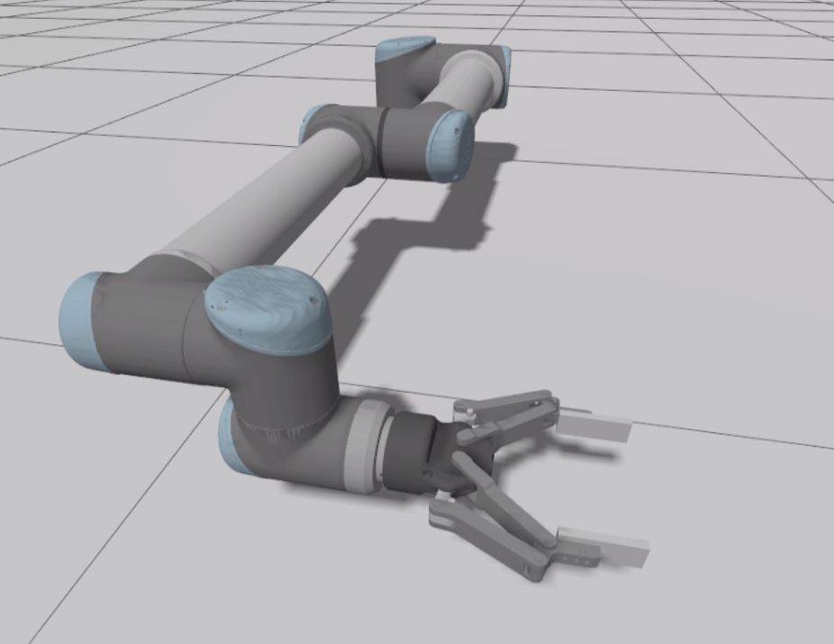
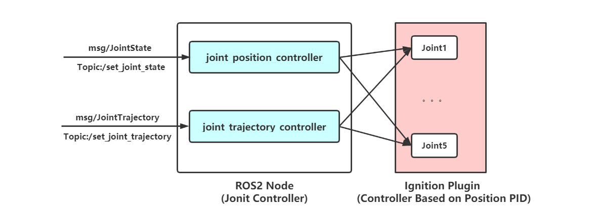

# universal_robot_ign

 `universal_robot_ign`  : Run universal robot  in Ignition Gazebo simulator . 

It provides SDF models of universal robot for Ignition Gazebo. In addition, it also provides a moveit2 application demo and simple  grasp demo with Gripper Robotiq140 . 

## Usage

### Install

* ROS 2: Galactic
* Ignition : Fortress
* dependencies:`moveit2`, `xmacro`, `sdformat_tools` (from source code)

```bash
#install dependency
pip install xmacro
sudo apt-get install ros-galactic-moveit
export IGNITION_VERSION=fortress
#cd src of ros2 workspace and download source code
git clone https://github.com/gezp/sdformat_tools.git
git clone https://github.com/gezp/universal_robot_ign.git
#cd ros2 workspace and build
colcon build
```

###  UR10 moveit2 demo

launch Ignition Gazebo simulator for UR10 

```bash
ros2 launch universal_robot_ign ur10_ign.launch.py 
```

* `joint_trajectory_controller` will be used in this demo

launch moveit2 `move_group` action server for UR10.

```bash
ros2 launch universal_robot_ign ur10_moveit2_demo.launch.py 
```

run moveit2  client node, plan to goal

```bash
ros2 run universal_robot_ign test_pose_goal.py
```

* start position <-> goal pose:  `[-0.0, 0.4, 0.6, 0.0, 0.0, 0.0]`  (loop)

the result:


### UR10 + Robotiq140 Grasp demo

* control gripper Robotiq140  to grasp object and control UR10  based on joint  position.

launch Ignition Gazebo simulator for UR10  + Robotiq140

```bash
ros2 launch universal_robot_ign ur10_robotiq140_ign.launch.py 
```

*  use  Ignition plugin `RobotiqController` to control Robotiq140.

run gripper test node to grasp stick model by closing gripper 

```bash
ros2 run universal_robot_ign test_gripper.py 
#1 : close gripper to grasp.
#0 : open gripper.
```


the result: 


## Models

the package contains some SDF models :

* robotic arm `universal_robot` models : `ur3`,`ur5`,`ur10` 
* robotic gripper models: `robotiq140 `

in addition, it also provides a combination model `ur10_robotiq140` (`resource/xmacro/ur10_robotiq140.sdf.xmacro`), which  is `ur10` robotic arm attached `robotiq140` gripper.

> the sdf files of these models are written modularly by use [xmacro](https://github.com/gezp/xmacro) which is a xml macro tool.



## Controllers

### UR Controller



Ignition Controller

* Ignition plugin `ignition-gazebo-joint-position-controller-system` is used to control joints of robotic arm .
* The position PID parameter should be set in plugins.

>  PID parameter：
>
> * The PID parameter of Ignition joint position controller plugin is set roughly ,so the performance of control is not well, you can modify PID parameter by modifying SDF file of model.

ROS controller

* `joint_position_controller` 
  *  receive ROS msg `sensor_msgs::msg::JointState` and publish target position `ignition::msgs::Double` for each joint (control based on position pid) . 
  * it's a simple communication bridge 
* `joint_trajectory_controller` 
  * receive ROS msg `trajectory_msgs::msg::JointTrajectory`
  * use interpolation based on time for joint trajectory and  keep publishing target position according to current time until the last trajectory point is processed .
  * this is not the most efficient way, but easy to Implement (it can work well with moveit2)

### Robotiq Ignition Controller

Ignition Plugin `RobotiqController`  is created to control Robotiq  Gripper(2 fingers gripper) . 

Add plugin In SDF

```xml
<plugin filename="RobotiqController" name="ignition::gazebo::systems::RobotiqController">
	<gripper_name>gripper</gripper_name>
    <fixed>false</fixed>
    <vel_scale>1.0</vel_scale>
</plugin>    
```

* some code snippets  like joint name of model's joint are hardcoded  In Plugin `RobotiqController` 
* the tag `fixed` with `ture`  will make `RobotiqController`  use `detachable joint ` to  fix  grasped object with gripper.

> `RobotiqController`  can be modified to get parameters from SDF which  can work for genenral 2 fingers gripper,however, it is trivial so that I have no plan to implement this function currently.

Create Node  `ros_ign_bridge`  to transfer Msg from ROS2 to Ignition

```python
ros_ign_bridge = Node(package='ros_ign_bridge',executable='parameter_bridge',
	arguments=["/model/ur10/gripper@std_msgs/msg/Bool]ignition.msgs.Boolean"],
	remappings=[("/model/ur10/gripper","/gripper"),],
    output='screen'
)
```

Publish ROS2 msg

* use `scripts/test_gripper.py`

> Slipping Problem
>
> There is Gripper Slipping Problem on Gazebo-classic which need use plugin to add fixed joint between object and gripper when grasp.   
>
> Ignition Gazebo performs better than Gazebo-classic on the Grasp Task, but also exists some problem in some situations.
>
> * it can grasp box tightly In Ignition Gazebo
>   * it performs better than Gazebo-classic.
> * it can't grasp sphere In Ignition Gazebo (RobotiqController is based on velocity control, not effort control)
>   * Because the size of contact area is so small that the friction is not enough to hold grasped object, and property `max_depth`  of `contact`  is not implemented In Ignition Gazebo currently.
>   * In this situation, a fixed joint is needed to fix object with gripper, you can modified SDF and set Tag `fixed` with `ture`.

## Maintainer and License

Maintainer : Zhenpeng Ge, [zhenpeng.ge@qq.com](mailto:zhenpeng.ge@qq.com)

universal_robot_ign is provided under MIT License.

> * the 3d model is from  [ros-industrial/universal_robot](https://github.com/ros-industrial/universal_robot) and  [ros-industrial/robotiq](https://github.com/ros-industrial/robotiq) which are provided under BSD License.
> * some code snippets is from [ign_moveit2](https://github.com/AndrejOrsula/ign_moveit2)  for ur10 moveit2 demo .
